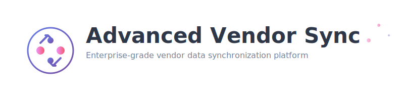
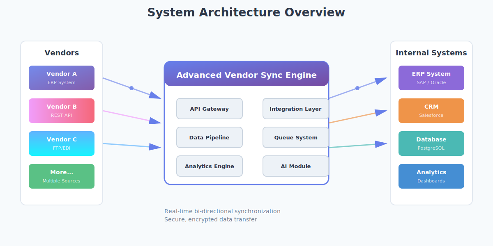
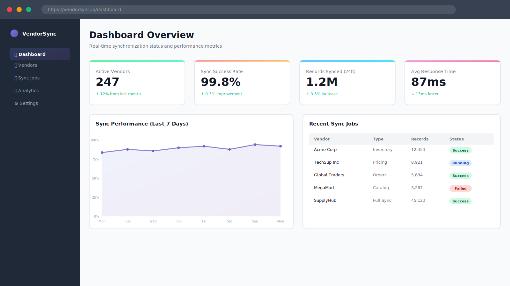
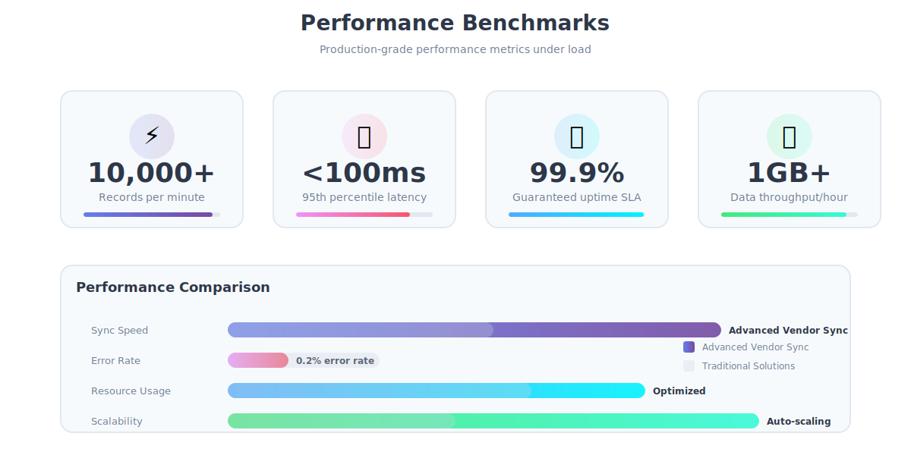

<div align="center">



# Advanced Vendor Sync

### Enterprise-grade platform for seamless vendor data synchronization


</div>

---

## 📖 Overview

Advanced Vendor Sync is a robust, enterprise-grade platform designed to streamline vendor data synchronization across multiple systems. Built with scalability, security, and reliability at its core, it enables businesses to maintain consistent vendor information, inventory levels, pricing, and order fulfillment data in real-time.



---

## ✨ Key Highlights

- 🔄 **Real-time Synchronization** - Bi-directional data sync with conflict resolution
- 🔌 **Universal Integration** - Connect with ERP, CRM, SCM, and accounting systems
- 🛡️ **Enterprise Security** - End-to-end encryption with role-based access control
- 📊 **Advanced Analytics** - Comprehensive dashboards and performance metrics
- 🤖 **AI-Powered** - Intelligent anomaly detection and predictive insights
- ⚡ **High Performance** - Cloud-native architecture with auto-scaling

---

## 🚀 Features


### 1. Vendor Onboarding & Profile Management
- Centralized vendor registration and verification
- Vendor profile management (business details, contracts, compliance)
- Multi-vendor categorization (suppliers, service providers, partners)
- Approval workflows for new vendors

### 2. Real-Time Data Synchronization
- Bi-directional data sync between vendors and internal systems
- Automatic synchronization of inventory, pricing, and availability
- Real-time updates using event-driven architecture
- Conflict detection and resolution mechanisms

### 3. Multi-Source Integration Engine
- Integration with ERP, CRM, SCM, and accounting systems
- API-based and file-based (CSV/XML/JSON) vendor data ingestion
- Support for REST, Webhooks, FTP, and EDI protocols
- Vendor-specific data adapters

### 4. Inventory & Supply Sync
- Live inventory level synchronization
- Stock threshold alerts and reorder triggers
- Batch and real-time inventory updates
- SKU-level mapping across vendors

### 5. Pricing & Catalog Synchronization
- Dynamic price updates from vendors
- Product catalog versioning
- Automated discount and contract-based pricing sync
- Historical pricing comparison and audit trail

### 6. Order & Fulfillment Synchronization
- Purchase order creation and status sync
- Shipment tracking and delivery updates
- Invoice synchronization and reconciliation
- Partial fulfillment and exception handling

### 7. Data Validation & Quality Control
- Schema validation before data ingestion
- Duplicate detection and cleansing
- Automated data normalization
- Error handling and retry mechanisms

### 8. Vendor Performance Monitoring
- Vendor reliability and delivery metrics
- SLA compliance tracking
- Lead-time and fulfillment accuracy analysis
- Vendor rating and scoring system

### 9. Sync Scheduling & Automation
- Configurable sync intervals (real-time, hourly, daily)
- Rule-based triggers for synchronization
- Event-driven sync for critical updates
- Manual override and forced sync options

### 10. Security & Access Control
- Vendor-specific access permissions
- API key and token-based authentication
- Encrypted data transfer and storage
- Secure sandbox for vendor testing

### 11. Logging, Auditing & Traceability
- Complete sync logs with timestamps
- Change history for all vendor data
- Rollback support for faulty sync operations
- Compliance-ready audit reports

### 12. Analytics & Reporting
- Sync success and failure analytics
- Vendor data freshness indicators
- Operational dashboards
- Exportable compliance and performance reports

### 13. Scalability & Reliability
- Cloud-native scalable architecture
- Asynchronous processing for large data volumes
- Fault-tolerant sync pipelines
- High availability and failover support

### 14. Admin & Configuration Panel
- Vendor sync rule configuration
- Integration health monitoring
- Error resolution dashboard
- System-level configuration management

### 15. AI-Assisted Enhancements
- Predictive sync failure detection
- Anomaly detection in vendor data
- Automated vendor recommendations
- Intelligent conflict resolution suggestions

---

## 🏗️ Architecture


Our platform follows a modern microservices architecture with the following components:

- **API Gateway** - Request routing and authentication
- **Sync Engine** - Core synchronization logic with queue management
- **Integration Layer** - Vendor-specific adapters and connectors
- **Data Pipeline** - ETL processes and validation
- **Analytics Engine** - Real-time metrics and reporting
- **Admin Dashboard** - Configuration and monitoring interface

---

## 🛠️ Technology Stack

<div align="center">

| Category | Technologies |
|----------|-------------|
| **Backend** | Node.js, Express.js |
| **Databases** | PostgreSQL, MongoDB |
| **Caching & Queues** | Redis, Bull Queue |
| **Authentication** | JWT, OAuth2 |
| **File Processing** | CSV, XML, JSON parsers |
| **Testing** | Jest, Supertest |
| **Frontend** | React, HTML5, CSS3 |
| **DevOps** | Docker, Docker Compose |

</div>

---

## 📁 Project Structure

```
advanced-vendor-sync/
├── README.md                 # Project documentation
├── .env                      # Environment variables
├── .gitignore               # Git ignore rules
├── package.json             # Node.js dependencies
├── docker-compose.yml       # Docker services configuration
├── docs/                    # Documentation files
│   ├── images/             # README images
│   ├── api-specification.md
│   └── security.md
├── config/                  # Configuration files
│   ├── database.js
│   ├── redis.js
│   └── integrations.js
├── src/                     # Backend source code
│   ├── controllers/
│   ├── models/
│   ├── services/
│   ├── middleware/
│   ├── utils/
│   └── routes/
├── frontend/                # Frontend application
│   ├── public/
│   ├── src/
│   └── package.json
└── scripts/                 # Utility scripts
    ├── migrate.js
    └── seed.js
```

---

## 🚦 Getting Started

### Prerequisites

Ensure you have the following installed:

- **Node.js** 18+ ([Download](https://nodejs.org/))
- **PostgreSQL** 14+ ([Download](https://www.postgresql.org/download/))
- **Redis** 6+ ([Download](https://redis.io/download))
- **Docker** (optional) ([Download](https://www.docker.com/))

### Installation

1. **Clone the repository**
```bash
git clone https://github.com/yourusername/advanced-vendor-sync.git
cd advanced-vendor-sync
```

2. **Install dependencies**
```bash
npm install
```

3. **Set up environment variables**
```bash
cp .env.example .env
# Edit .env with your configuration
```

4. **Set up database**
```bash
npm run db:migrate
npm run db:seed
```

5. **Start services**

Using Docker Compose (recommended):
```bash
docker-compose up -d
```

Or manually:
```bash
# Start Redis
redis-server

# Start PostgreSQL
# (depends on your installation)

# Start the application
npm run dev
```

6. **Access the application**
- Frontend: http://localhost:3000
- API: http://localhost:8000/api
- Admin Dashboard: http://localhost:3000/admin

---

## 📝 API Documentation

Comprehensive API documentation is available at `/docs/api-specification.md`.

### Quick API Examples

**Create a vendor:**
```bash
POST /api/vendors
Content-Type: application/json
Authorization: Bearer <token>

{
  "name": "Acme Corporation",
  "email": "contact@acme.com",
  "category": "supplier"
}
```

**Trigger sync:**
```bash
POST /api/sync/trigger
Content-Type: application/json
Authorization: Bearer <token>

{
  "vendorId": "123",
  "syncType": "full"
}
```

**Get vendor analytics:**
```bash
GET /api/analytics/vendor/123
Authorization: Bearer <token>
```

---

## 📊 Dashboard Preview



---

## 🔒 Security

Security is paramount in our platform. We implement:

- **Encryption**: All data in transit (TLS 1.3) and at rest (AES-256)
- **Authentication**: JWT tokens with refresh mechanism
- **Authorization**: Role-based access control (RBAC)
- **API Security**: Rate limiting, input validation, SQL injection prevention
- **Audit Logging**: Complete audit trail for compliance
- **Vulnerability Scanning**: Regular security assessments


---

## 🧪 Testing

Run the test suite:

```bash
# Run all tests
npm test

# Run tests with coverage
npm run test:coverage

# Run integration tests
npm run test:integration

# Run E2E tests
npm run test:e2e
```

---

## 📈 Performance



- **Sync Speed**: 10,000+ records per minute
- **API Response Time**: < 100ms (95th percentile)
- **Uptime**: 99.9% SLA
- **Concurrent Vendors**: 1,000+ simultaneous connections
- **Data Throughput**: 1GB+ per hour

---


## 👤 Creator

- 💼 **Created by**: Kshama Mishra


---

<div align="center">


Created by Kshama Mishra

</div>
