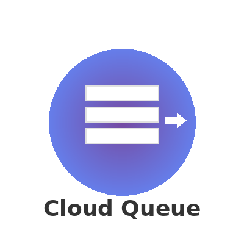
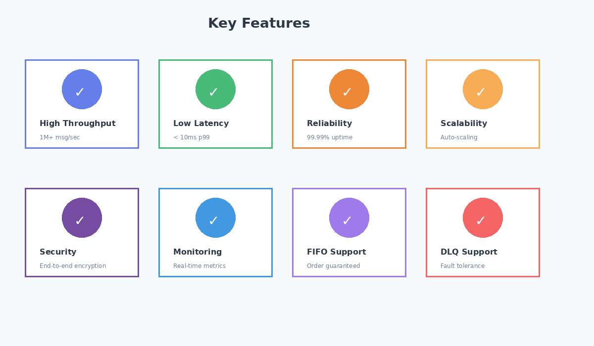
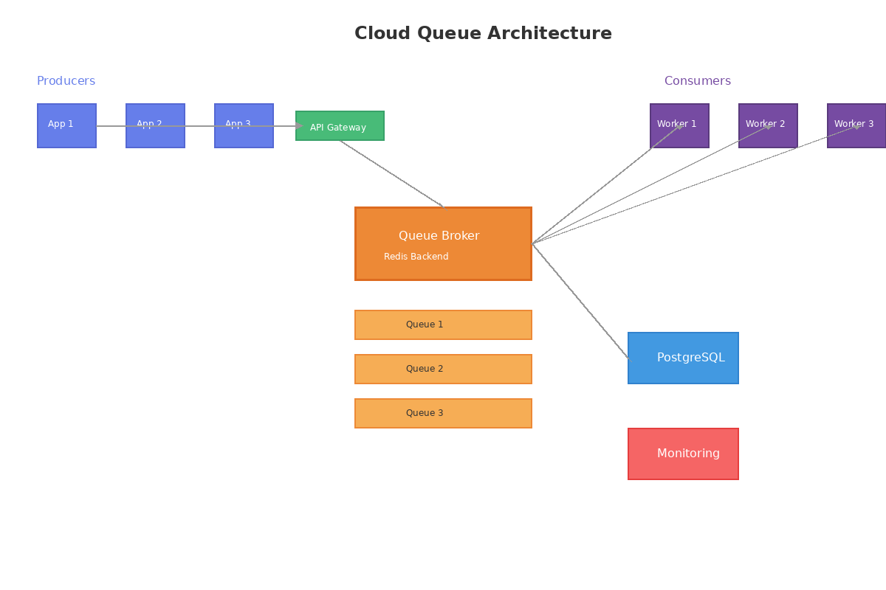
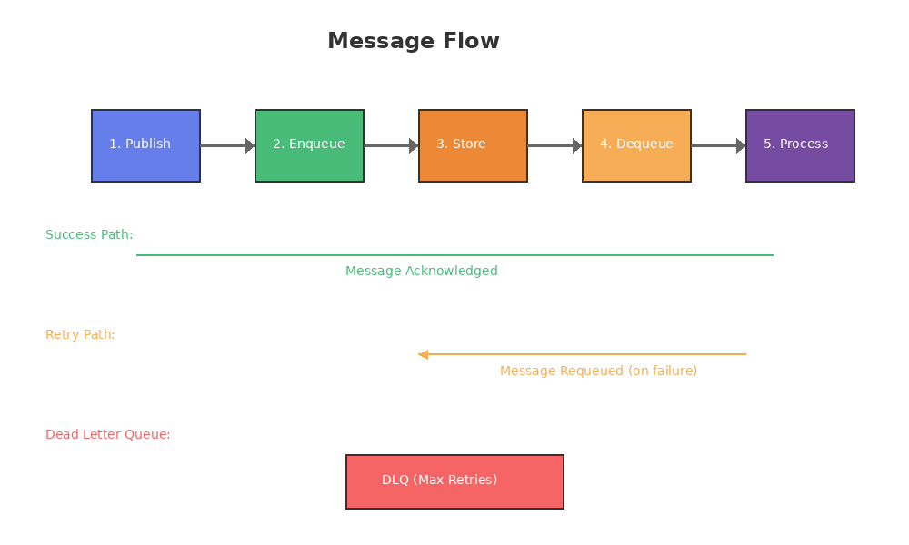
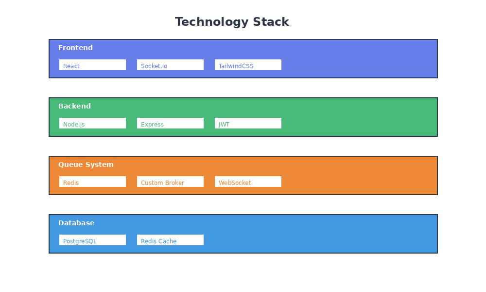
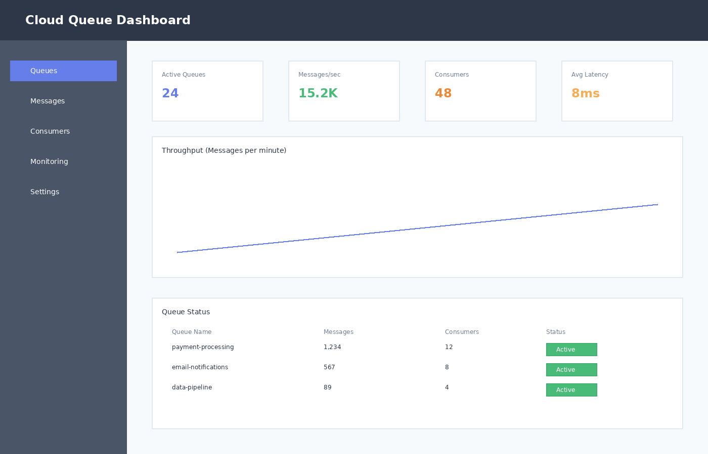
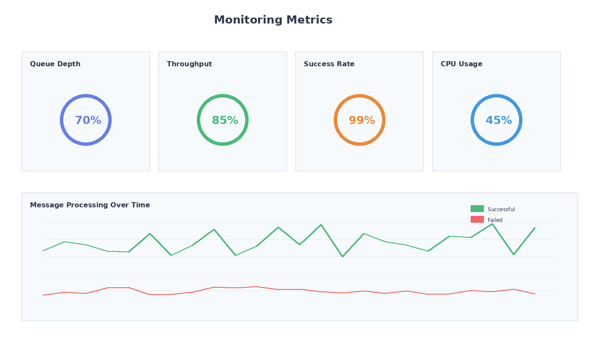

# Cloud Queue

<p align="center">
  
</p>

<p align="center">
  <strong>Advanced cloud-native message queue system with high throughput, reliability, and scalability.</strong>
</p>


---


## 🚀 Features



### 1. Queue Management
- Create, configure, and delete queues
- Support for standard, priority, and delay queues
- FIFO and non-FIFO queue handling
- Message size and retention configuration

### 2. Message Publishing & Consumption
- Producer APIs for publishing messages
- Consumer workers for message processing
- Acknowledgment and retry handling
- Batch message publish and consume support

### 3. Asynchronous Task Processing
- Background job execution using queues
- Parallel message consumption
- Worker auto-scaling
- Long-running task support

### 4. Reliability & Fault Tolerance
- At-least-once and exactly-once delivery modes
- Dead Letter Queue (DLQ) support
- Automatic retries with backoff strategy
- Message visibility timeout handling

### 5. Event-Driven Architecture Support
- Event publishing and subscription model
- Fan-out and topic-based queues
- Event filtering and routing
- Microservices decoupling

### 6. Scheduling & Delay Queues
- Scheduled message delivery
- Delayed execution of tasks
- Cron-based job scheduling via queue
- Time-based message activation

### 7. Monitoring & Observability
- Queue depth and throughput metrics
- Consumer lag monitoring
- Message processing latency analysis
- Health checks and alerts

### 8. Security & Access Control
- Role-based access for producers and consumers
- API key and token-based authentication
- Encrypted message storage and transit
- Secure multi-tenant isolation

### 9. Scalability & Performance
- Horizontal scaling of producers and consumers
- Load-balanced message distribution
- High-throughput, low-latency processing
- Cloud-native deployment readiness

### 10. Logging & Auditing
- Message lifecycle logging
- Publish and consume audit trails
- Error and failure logs
- Compliance-ready audit reports

### 11. Integration & API Layer
- REST and event-based APIs
- SDK support for multiple languages
- Webhook integration
- Integration with cloud services and microservices

### 12. Admin & Control Dashboard
- Queue and worker management UI
- Real-time metrics visualization
- Pause, resume, and purge queues
- Configuration management

---

## 🏗️ Architecture

<p align="center">
  
</p>

### Message Flow

<p align="center">
  
</p>

---

## 📁 Project Structure

```
cloud-queue/
├── README.md
├── .env
├── .gitignore
├── package.json
├── docker-compose.yml
├── docs/
│   ├── images/
│   │   ├── logo.png
│   │   ├── architecture-diagram.png
│   │   ├── message-flow.png
│   │   ├── features-overview.png
│   │   ├── dashboard-preview.png
│   │   └── monitoring-metrics.png
│   ├── api-documentation.md
│   └── security.md
├── config/
├── src/
├── frontend/
└── scripts/
```

---

## 🛠️ Technology Stack

<p align="center">
  
</p>

- **Backend**: Node.js, Express.js
- **Database**: PostgreSQL, Redis
- **Queue**: Custom broker with Redis backend
- **Authentication**: JWT, API Keys
- **Real-time**: WebSocket (Socket.io)
- **Testing**: Jest, Supertest
- **Containerization**: Docker, Docker Compose
- **Monitoring**: Prometheus, Grafana (optional)

---

## 🚦 Getting Started

### Prerequisites

- Node.js 18+
- PostgreSQL 14+ (optional - server runs without it)
- Redis 6+ (optional - server runs without it)
- Docker (optional)

### Quick Start (Without Database)

The application can run in demo mode without PostgreSQL or Redis for testing the dashboard and API.

1. **Navigate to project directory**
```bash
cd cloud-queue-main
```

2. **Install dependencies**
```bash
npm install
```

3. **Create environment file**
Create a `.env` file in the root directory:
```env
# Cloud Queue Configuration
NODE_ENV=development
PORT=3000

# Database Configuration (PostgreSQL) - Optional
DB_HOST=localhost
DB_PORT=5432
DB_NAME=cloud_queue
DB_USER=postgres
DB_PASSWORD=postgres

# Redis Configuration - Optional
REDIS_HOST=localhost
REDIS_PORT=6379
REDIS_PASSWORD=

# JWT Configuration
JWT_SECRET=cloud-queue-secret-key-2024
JWT_EXPIRES_IN=24h

# Rate Limiting
RATE_LIMIT_WINDOW_MS=900000
RATE_LIMIT_MAX_REQUESTS=1000

# CORS
CORS_ORIGIN=*

# Logging
LOG_LEVEL=info
LOG_DIR=./logs
```

4. **Start the server**
```bash
npm start
# Or for development with auto-reload
npm run dev
# Or directly with Node.js
node src/server.js
```

5. **Access the application**
- **Dashboard**: http://localhost:3000
- **Health Check**: http://localhost:3000/health
- **API Base URL**: http://localhost:3000/api/v1

### Full Installation (With Database)

1. **Clone the repository**
```bash
git clone <repository-url>
cd cloud-queue
```

2. **Install dependencies**
```bash
npm install
```

3. **Set up environment variables**
```bash
cp .env.example .env
# Edit .env with your configuration
```

4. **Set up database**
```bash
npm run db:migrate
npm run db:seed
```

5. **Start services**
```bash
# Using Docker Compose
docker-compose up -d

# Or manually
npm run dev
```

6. **Access the application**
- **Dashboard**: http://localhost:3000
- **API**: http://localhost:3000/api/v1
- **Monitoring**: http://localhost:9090

### Available Scripts

| Command | Description |
|---------|-------------|
| `npm start` | Start the production server |
| `npm run dev` | Start development server with hot reload |
| `npm run worker` | Start background worker |
| `npm test` | Run all tests |
| `npm run test:unit` | Run unit tests |
| `npm run test:integration` | Run integration tests |
| `npm run db:migrate` | Run database migrations |
| `npm run db:seed` | Seed database with sample data |
| `npm run lint` | Run ESLint |
| `npm run docker:up` | Start Docker containers |
| `npm run docker:down` | Stop Docker containers |

---

## 💡 Usage Examples

### Publishing a Message

```javascript
const { QueueClient } = require('cloud-queue-sdk');

const client = new QueueClient({
  apiKey: 'your-api-key',
  endpoint: 'http://localhost:3000'
});

// Publish a message
await client.publish('my-queue', {
  body: { task: 'process-order', orderId: '12345' },
  delay: 0,
  priority: 'normal'
});
```

### Consuming Messages

```javascript
// Create a consumer
const consumer = client.createConsumer('my-queue', {
  batchSize: 10,
  visibilityTimeout: 30
});

consumer.on('message', async (message) => {
  console.log('Processing:', message.body);
  
  // Process the message
  await processOrder(message.body.orderId);
  
  // Acknowledge the message
  await message.ack();
});

consumer.start();
```

---

## 📊 Monitoring

<p align="center">
  
</p>

### Key Metrics

<p align="center">
  
</p>

- **Queue Depth**: Number of messages waiting in queue
- **Throughput**: Messages processed per second
- **Latency**: Average message processing time
- **Error Rate**: Failed message processing percentage
- **Consumer Lag**: Delay between message arrival and processing

---


### Quick Reference

| Endpoint | Method | Description |
|----------|--------|-------------|
| `/api/queues` | POST | Create a new queue |
| `/api/queues/:id` | GET | Get queue details |
| `/api/queues/:id/messages` | POST | Publish a message |
| `/api/queues/:id/messages` | GET | Consume messages |
| `/api/queues/:id/messages/:msgId` | DELETE | Acknowledge message |


### Security Features

- 🔐 JWT-based authentication
- 🔑 API key management
- 🛡️ Role-based access control (RBAC)
- 🔒 End-to-end encryption
- 📝 Audit logging
- 🚨 Rate limiting and DDoS protection

---


## 👤 Creator

- 💼 **Created by**: Kshama Mishra

---

<p align="center">
  Created by Kshama Mishra
</p>
