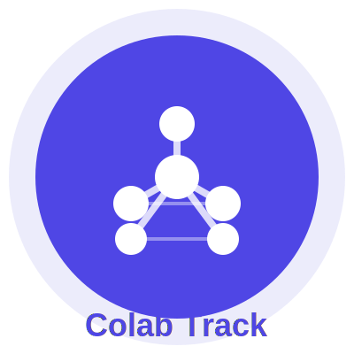
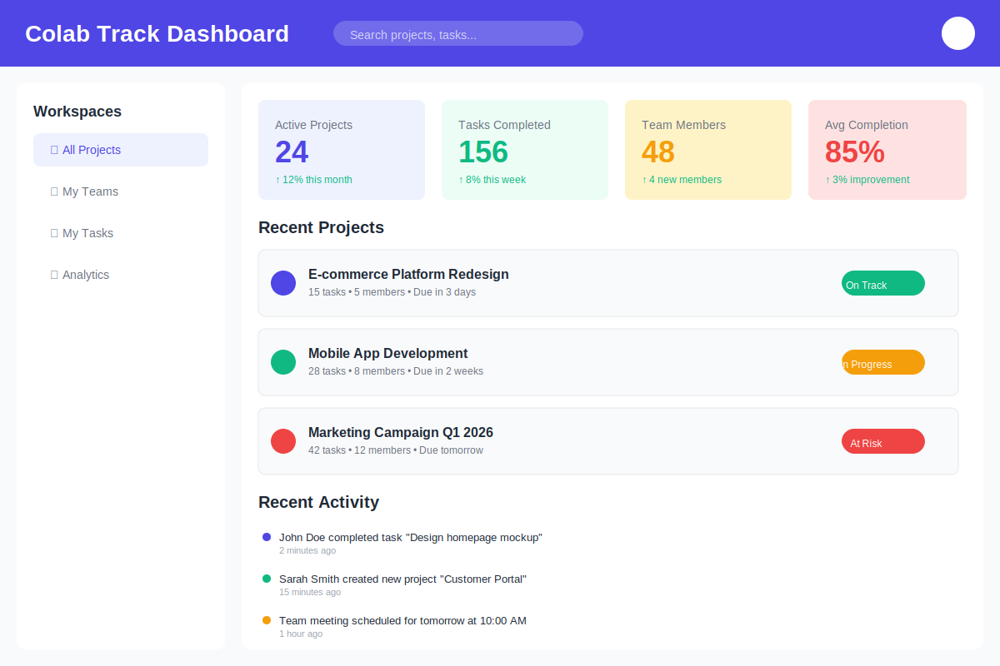
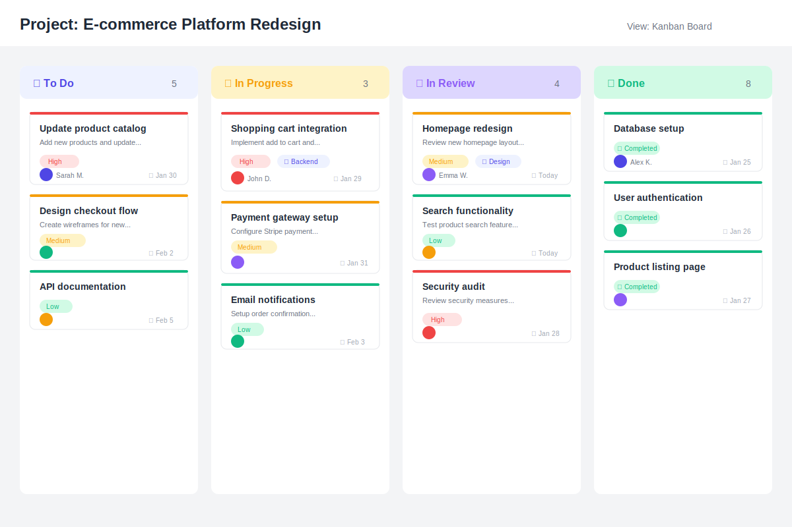
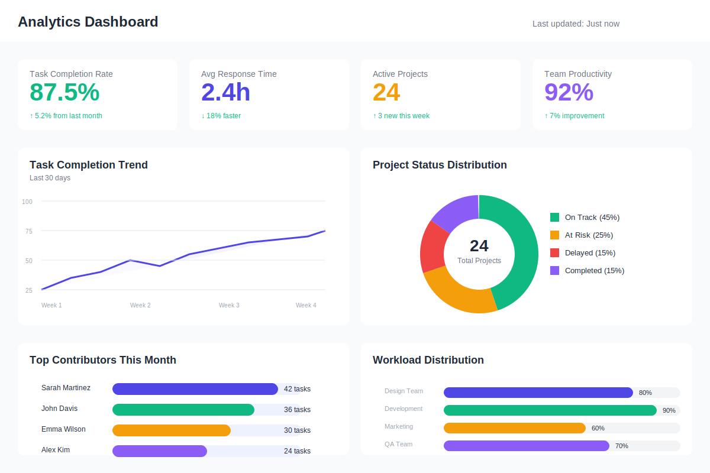
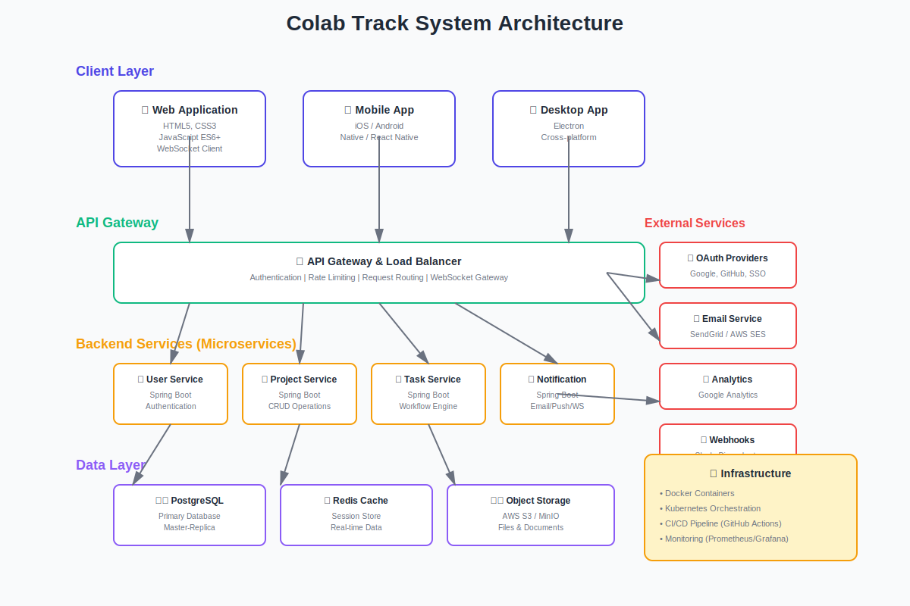
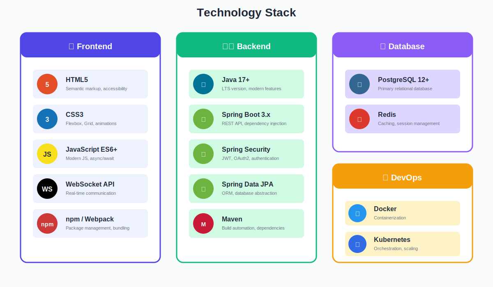
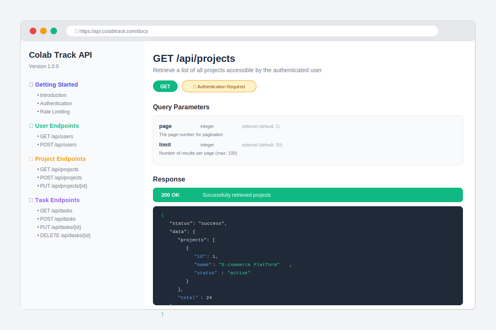

# Colab Track - Advanced Project Collaboration Platform

<div align="center">
  
  
  <p><strong>A comprehensive project management and collaboration tool with real-time features, analytics, and enterprise-grade security.</strong></p>
 
</div>

---


<div align="center">
  
  <p><em>Main Dashboard with Project Overview</em></p>
  
  
  <p><em>Kanban Board for Task Management</em></p>
  
  
  <p><em>Real-time Analytics and Insights</em></p>
</div>

---

## 🚀 Features

### 1. User & Team Management
- 🔐 Secure authentication (Email, OAuth, SSO)
- 👥 Role-based access control (Admin, Manager, Contributor, Viewer)
- 📧 Team creation and invitations
- 🏢 Organization-level workspace support

### 2. Project & Workspace Management
- 📁 Multiple projects within workspaces
- 🎯 Project goals, milestones, and timelines
- 👤 Project owners and collaborators
- 📦 Archive and version control

### 3. Task & Workflow Tracking
- ✅ Task creation with priority, deadlines, dependencies
- 📊 Kanban, List, and Timeline (Gantt) views
- ⚙️ Task status automation
- 🔄 Subtasks, checklists, and recurring tasks

### 4. Real-Time Collaboration
- ⚡ Live task updates
- 💬 Real-time comments and discussions
- 🔔 @Mentions and notifications
- 📰 Shared activity feed

### 5. File & Resource Collaboration
- 📤 Document upload and sharing
- 🔢 Version tracking
- 👁️ Inline preview and comments
- ☁️ Cloud storage integration

### 6. Communication & Notifications
- 📬 In-app notifications
- 📧 Email and push notifications
- ⚙️ Custom notification preferences
- 📋 Activity logs

### 7. Progress Monitoring & Analytics
- 📈 Project progress dashboards
- 📊 Productivity metrics
- ✔️ Task completion rates
- 📉 Visual analytics (charts, timelines)

### 8. Collaboration Insights
- 🏆 Contribution tracking
- ⚖️ Workload balancing
- 🚦 Bottleneck detection
- 🤖 AI-assisted suggestions

### 9. Time Tracking & Reporting
- ⏱️ Manual and automatic time tracking
- 📅 Weekly/monthly reports
- 📄 PDF/CSV export
- 🔌 Integration support

### 10. Version Control & Change History
- 📜 Complete audit trail
- 🔍 Track changes and history
- ↩️ Rollback capabilities
- 🔀 Activity comparison

### 11. Integration & API Support
- 🔌 REST API
- 🔗 Git, calendar, cloud tool integrations
- 🪝 Webhooks
- 🧩 Modular architecture

### 12. Security & Data Protection
- 🔒 Encrypted storage and communication
- 🎫 Secure tokens and sessions
- 💾 Backup and recovery
- ✅ Compliance-ready

### 13. Deployment & Scalability
- ☁️ Cloud-native architecture
- 🏗️ Microservices backend
- ⚡ Load balancing and caching
- 📱 Cross-platform responsive

### 14. Admin & System Controls
- 👀 User activity monitoring
- 🖥️ System health dashboards
- 📊 Access logs and error tracking
- ⚙️ Configuration management

### 15. Academic/Enterprise Extensions
- 📈 Team performance evaluation
- 📝 Project submission workflows
- 👨‍🏫 Mentor/supervisor access
- 📤 Exportable reports

---

## 🏗️ Architecture

<div align="center">
  
  <p><em>High-level System Architecture</em></p>
</div>

---

## 📁 Project Structure

```
colab-track/
├── frontend/          # HTML, CSS, JavaScript
│   ├── css/
│   ├── js/
│   ├── components/
│   └── index.html
├── backend/           # Java Spring Boot
│   ├── src/
│   │   ├── main/
│   │   │   ├── java/
│   │   │   └── resources/
│   │   └── test/
│   └── pom.xml
├── database/          # Database schemas and migrations
│   ├── schema.sql
│   └── migrations/
├── docs/              # Documentation
│   ├── API.md
│   └── DEPLOYMENT.md
├── images/            # README images
└── config/            # Configuration files
    └── docker-compose.yml
```

---

## 🛠️ Technology Stack

<div align="center">
  
</div>

| Layer | Technologies |
|-------|-------------|
| **Frontend** | HTML5, CSS3, JavaScript (ES6+), WebSocket API |
| **Backend** | Java 17+, Spring Boot, Spring Security, Spring Data JPA |
| **Database** | PostgreSQL 12+ / MySQL 8+ |
| **Real-time** | WebSocket (SockJS/STOMP) |
| **Build Tools** | Maven 3.6+, npm |
| **Deployment** | Docker, Kubernetes |
| **Testing** | JUnit 5, Mockito, Jest |
| **Documentation** | Swagger/OpenAPI |

---

## 🚦 Getting Started

### Prerequisites
- ☕ Java 17 or higher
- 📦 Maven 3.6+
- 🟢 Node.js 16+ (for frontend tools)
- 🐘 PostgreSQL 12+ or MySQL 8+
- 🐳 Docker (optional, for containerized deployment)

### Installation

#### 1️⃣ Clone the repository
```bash
git clone https://github.com/yourusername/colab-track.git
cd colab-track
```

#### 2️⃣ Backend Setup
```bash
cd backend
mvn clean install
```

#### 3️⃣ Frontend Setup
```bash
cd frontend
npm install
```

#### 4️⃣ Database Setup
```bash
# Option 1: Using PostgreSQL directly
createdb colabtrack
psql colabtrack < database/schema.sql

# Option 2: Using Docker Compose
docker-compose up -d postgres
```

#### 5️⃣ Configuration
Update `backend/src/main/resources/application.properties`:

```properties
# Database Configuration
spring.datasource.url=jdbc:postgresql://localhost:5432/colabtrack
spring.datasource.username=your_username
spring.datasource.password=your_password

# JWT Configuration
jwt.secret=your_secret_key_here
jwt.expiration=86400000

# OAuth Configuration (Optional)
spring.security.oauth2.client.registration.google.client-id=your_client_id
spring.security.oauth2.client.registration.google.client-secret=your_client_secret
```

---

### Running the Application

#### Option 1: Manual Setup

**Backend:**
```bash
cd backend
mvn spring-boot:run
```

**Frontend:**
```bash
cd frontend
npm start
# Or use any static file server like:
# python -m http.server 3000
```

#### Option 2: Docker Compose
```bash
docker-compose up
```

The application will be available at:
- **Frontend**: http://localhost:3000
- **Backend API**: http://localhost:8080/api
- **API Docs**: http://localhost:8080/api/docs

---

## 📝 API Documentation

<div align="center">
  
</div>

### Key Endpoints

| Method | Endpoint | Description |
|--------|----------|-------------|
| POST | `/api/auth/login` | User authentication |
| GET | `/api/projects` | List all projects |
| POST | `/api/projects` | Create new project |
| GET | `/api/tasks/{id}` | Get task details |
| PUT | `/api/tasks/{id}` | Update task |
| DELETE | `/api/tasks/{id}` | Delete task |

See [API Documentation](docs/API.md) for detailed API endpoints and usage.

---

## 🧪 Testing

```bash
# Run backend tests
cd backend
mvn test

# Run frontend tests
cd frontend
npm test

# Run integration tests
mvn verify
```

---

## 📦 Deployment

### Docker Deployment

```bash
# Build Docker images
docker-compose build

# Start services
docker-compose up -d

# View logs
docker-compose logs -f
```

### Kubernetes Deployment

```bash
# Apply configurations
kubectl apply -f k8s/

# Check status
kubectl get pods
kubectl get services
```

---


---

## 👤 Creator

- 💼 **Created by**: Kshama Mishra

---


---

<div align="center">
  <p>Created by Kshama Mishra</p>
  <p>⭐ Star us on GitHub if you find this project useful!</p>
</div>
