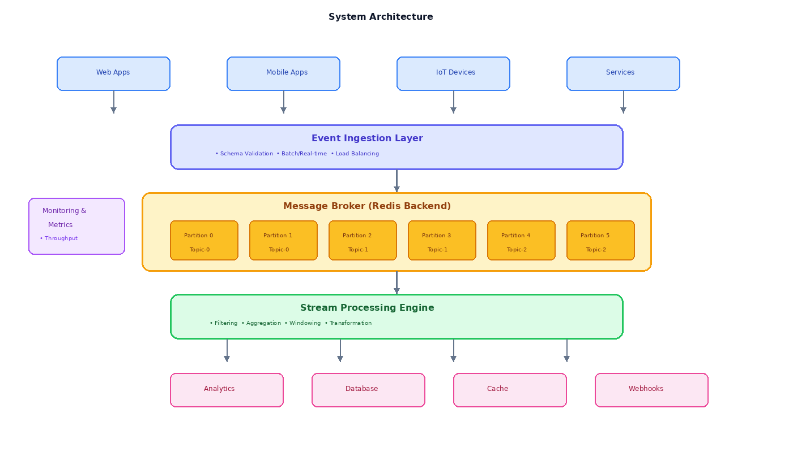
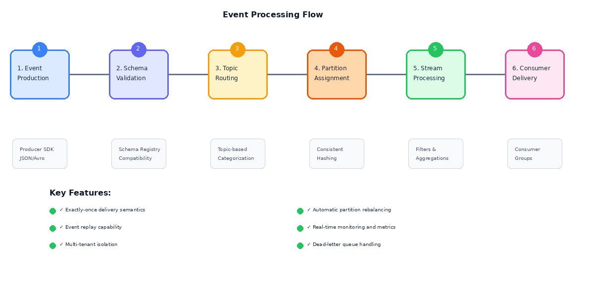
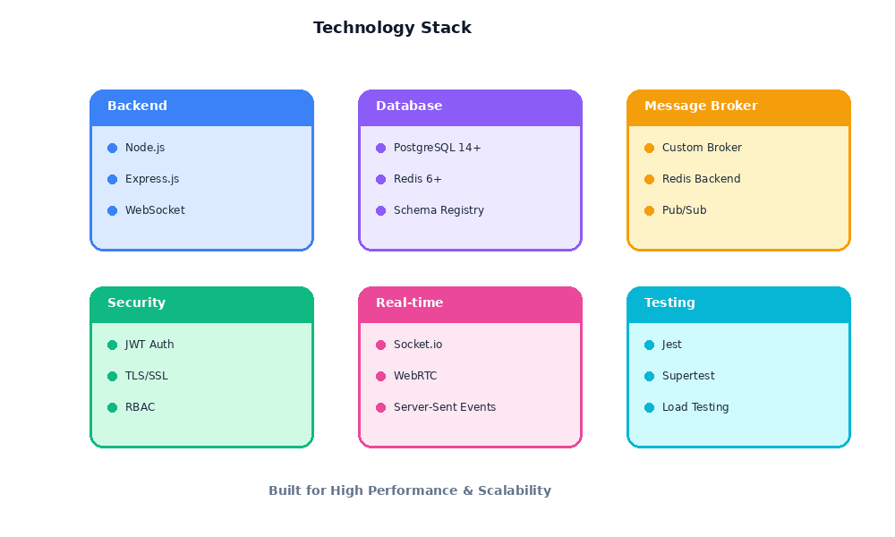

# Event Stream

<div align="center">


High-throughput, low-latency event streaming and processing platform for capturing, transmitting, processing, and analyzing continuous streams of events in real time.


</div>

---

## 📊 Architecture Overview



## 🚀 Features

### 1. Event Ingestion
- High-speed event producers
- Support for structured and semi-structured events
- Batch and real-time ingestion modes
- Schema-based event validation

### 2. Stream Processing Engine
- Real-time event processing pipelines
- Window-based processing (time, count, session)
- Event filtering, aggregation, and transformation
- Stateful and stateless stream processing

### 3. Topic & Partition Management
- Topic-based event categorization
- Partitioning for parallel processing
- Event ordering guarantees within partitions
- Retention and compaction policies

### 4. Event Consumers & Subscriptions
- Multiple consumer groups
- Independent offset management
- Replay and rewind capability
- Backpressure handling

### 5. Delivery Guarantees
- At-most-once, at-least-once, and exactly-once semantics
- Offset commit strategies
- Idempotent event handling
- Duplicate detection

### 6. Event Schema & Versioning
- Schema registry for events
- Backward and forward compatibility
- Schema evolution handling
- Data contract enforcement

### 7. Fault Tolerance & Recovery
- Event replication across nodes
- Automatic failover
- Checkpointing and state recovery
- Dead-event handling

### 8. Real-Time Analytics
- Stream-level metrics and KPIs
- Event rate, latency, and throughput analysis
- Live dashboards and alerts
- Trend and anomaly detection

### 9. Security & Access Control
- Producer and consumer authentication
- Topic-level authorization
- Encrypted event transmission
- Multi-tenant isolation

### 10. Event Routing & Fan-Out
- Event broadcasting to multiple consumers
- Conditional event routing
- Stream branching and merging
- Event enrichment pipelines

### 11. Integration & API Layer
- Producer and consumer SDKs
- REST APIs for stream management
- Webhooks for downstream systems
- Integration with microservices and data lakes

### 12. Scalability & Performance
- Horizontal scaling of brokers
- Elastic stream processing
- High availability configuration
- Cloud-native deployment readiness

## 🔄 Event Flow



## 📁 Project Structure

```
event-stream/
├── README.md
├── .env
├── .gitignore
├── package.json
├── docker-compose.yml
├── docs/
│   └── images/
│       ├── banner.png
│       ├── architecture.png
│       ├── event-flow.png
│       └── tech-stack.png
├── config/
├── src/
├── frontend/
└── scripts/
```

## 🛠️ Technology Stack

<div align="center">



</div>

- **Backend**: Node.js, Express.js
- **Database**: PostgreSQL
- **Cache**: Redis
- **Message Broker**: Custom broker with Redis backend
- **Authentication**: JWT
- **Real-time**: WebSocket (Socket.io)
- **Testing**: Jest, Supertest

## 🚦 Getting Started

### Prerequisites

- Node.js 18+
- PostgreSQL 14+
- Redis 6+
- Docker (optional)

### Installation

1. Clone the repository
```bash
git clone <repository-url>
cd event-stream
```

2. Install dependencies
```bash
npm install
```

3. Set up environment variables
```bash
cp .env.example .env
# Edit .env with your configuration
```

4. Set up database
```bash
npm run db:migrate
npm run db:seed
```

5. Start services
```bash
# Using Docker Compose
docker-compose up -d

# Or manually
npm run dev
```


---

## 👤 Creator

- 💼 **Created by**: Kshama Mishra

---

<div align="center">


Created by Kshama Mishra

</div>
