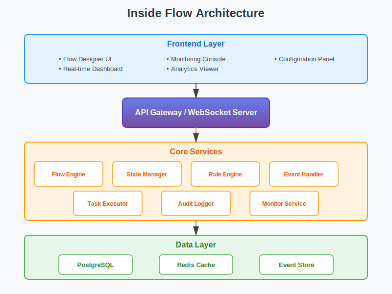
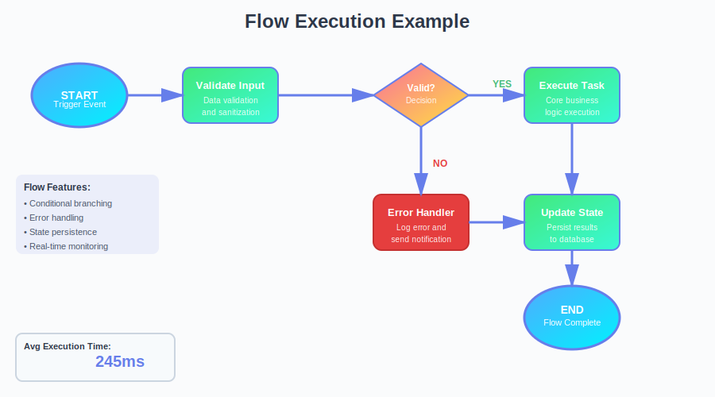

<div align="center">
  
</div>

# Inside Flow

Advanced internal process orchestration and data-flow management platform for controlling, monitoring, and optimizing internal operations within systems and organizations.


## 🚀 Features

### 1. Internal Process Definition
- Define internal workflows and operational flows
- Step-by-step process modeling
- Sequential and parallel execution paths
- Reusable internal flow templates

### 2. State & Transition Management
- State-based flow execution
- Controlled transitions between internal states
- Validation rules before state movement
- Rollback and reprocessing support

### 3. Internal Data Routing
- Controlled data movement between modules
- Context-aware data passing
- Input/output mapping for each internal stage
- Data transformation during transitions

### 4. Rule & Decision Engine
- Conditional logic for internal flow decisions
- Rule-based branching
- Priority and dependency evaluation
- Dynamic path selection

### 5. Task & Action Execution
- Automatic execution of internal actions
- Sync and async internal tasks
- Action chaining
- Failure isolation per action

### 6. Internal Event Handling
- Internal event generation and consumption
- Event-triggered flow transitions
- Listener-based architecture
- Event replay support

### 7. Monitoring & Flow Visualization
- Real-time internal flow status
- Step-level execution tracking
- Bottleneck identification
- Flow heatmaps and timelines

### 8. Error Handling & Recovery
- Step-level error detection
- Retry and fallback mechanisms
- Graceful degradation
- Internal incident logs

### 9. Audit & Traceability
- Full trace of internal flow execution
- Who/what triggered each step
- Timestamped state changes
- Compliance-ready logs

### 10. Performance Optimization
- Flow execution time analysis
- Internal latency tracking
- Resource utilization insights
- Optimization recommendations

### 11. Configuration & Governance
- Centralized flow configuration
- Version control for internal flows
- Access control for flow editing
- Environment-based flow behavior

### 12. Scalability & Reliability
- Parallel internal flow execution
- Stateless execution nodes
- Fault-tolerant design
- Horizontal scalability

## 🏗️ Architecture

<div align="center">
  
</div>

The Inside Flow platform is built on a modern, scalable architecture consisting of:

- **Frontend Layer**: Intuitive UI for flow design, monitoring, and configuration
- **API Gateway**: Centralized entry point with WebSocket support for real-time updates
- **Core Services**: Modular microservices handling flow execution, state management, and event processing
- **Data Layer**: PostgreSQL for persistent storage, Redis for caching, and dedicated event store

## 📊 Workflow Example

<div align="center">
  
</div>

This diagram illustrates a typical flow execution with validation, decision-making, error handling, and state persistence.

## 📁 Project Structure

```
inside-flow/
├── README.md
├── .env
├── .gitignore
├── package.json
├── docker-compose.yml
├── docs/
│   ├── images/
│   │   ├── banner.svg
│   │   ├── architecture.svg
│   │   ├── workflow-example.svg
│   │   └── features-overview.svg
│   ├── api-documentation.md
│   └── security.md
├── config/
├── src/
├── frontend/
└── scripts/
```

## 🛠️ Technology Stack

- **Backend**: Node.js, Express.js
- **Database**: PostgreSQL
- **Cache**: Redis
- **State Machine**: XState
- **Authentication**: JWT
- **Real-time**: WebSocket (Socket.io)
- **Testing**: Jest, Supertest

## 🚦 Getting Started

### Prerequisites

- Node.js 18+
- PostgreSQL 14+
- Redis 6+
- Docker (optional)

### Installation

1. Clone the repository

```bash
git clone <repository-url>
cd inside-flow
```

2. Install dependencies

```bash
npm install
```

3. Set up environment variables

```bash
cp .env.example .env
# Edit .env with your configuration
```

4. Set up database

```bash
npm run db:migrate
npm run db:seed
```

5. Start services

```bash
# Using Docker Compose
docker-compose up -d

# Or manually
npm run dev
```


---

## 👤 Creator

- 💼 **Created by**: Kshama Mishra

---

<div align="center">
  <p>Created by Kshama Mishra</p>
 
</div>
