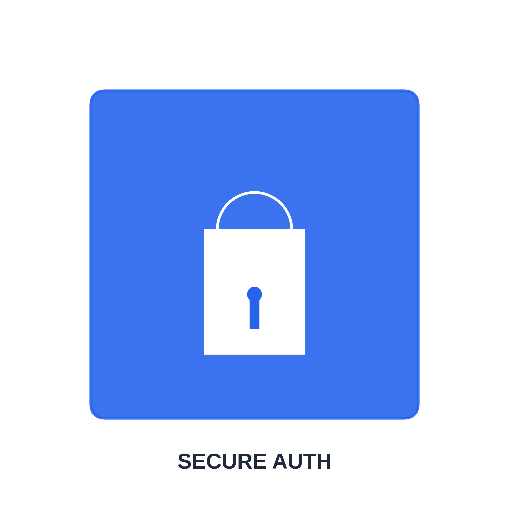
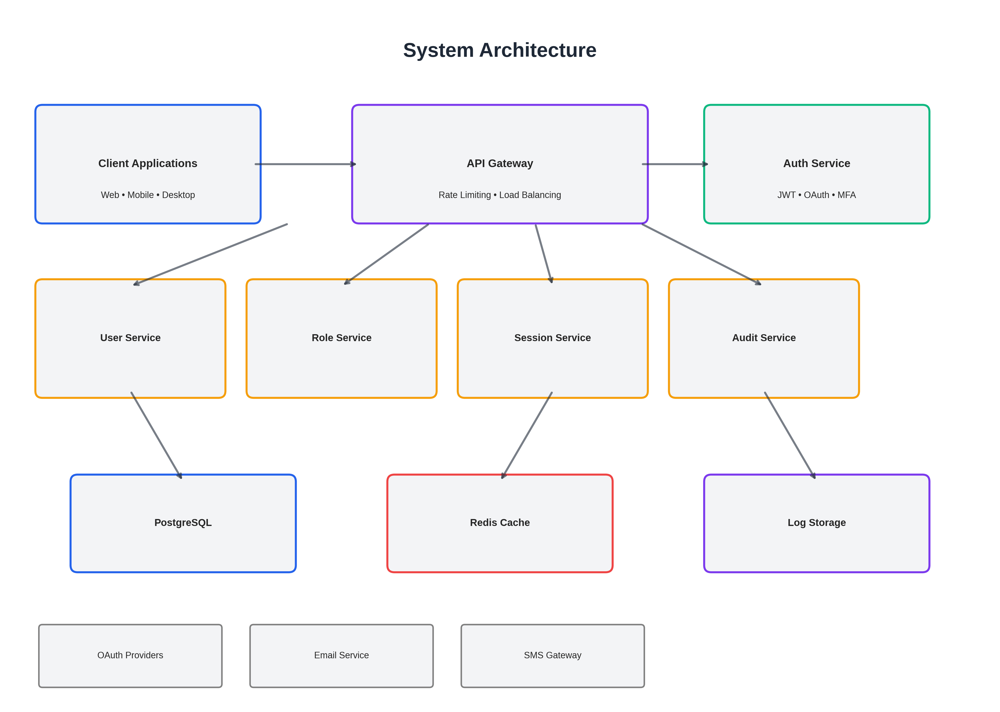
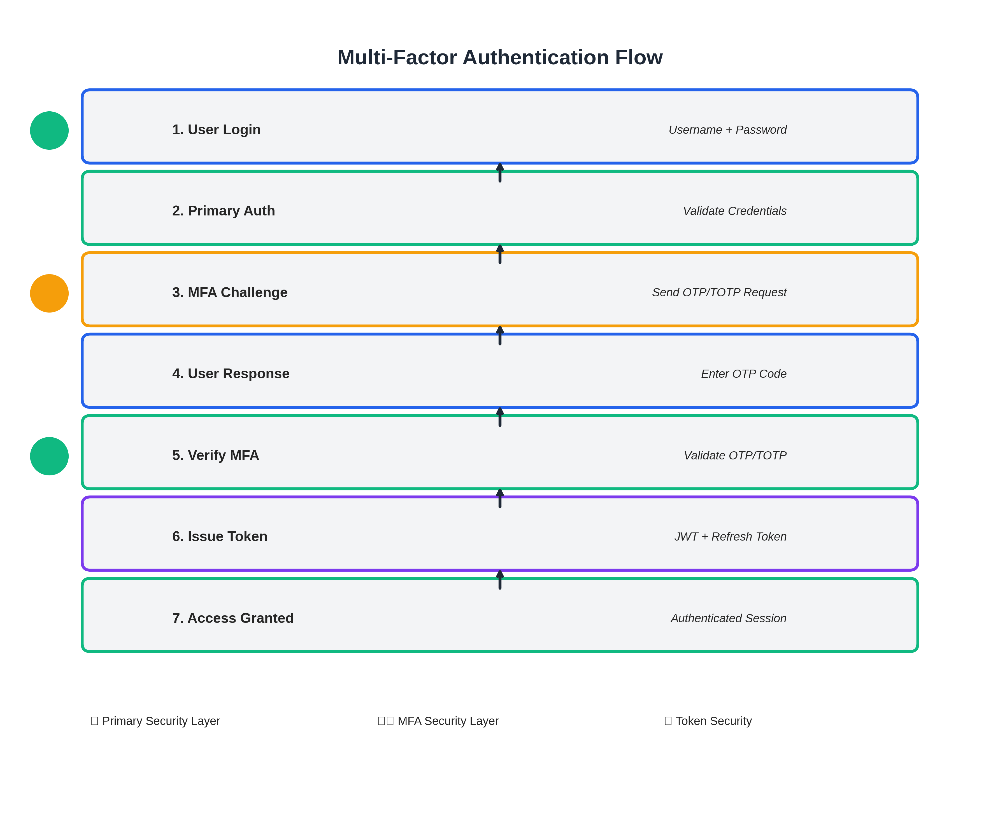
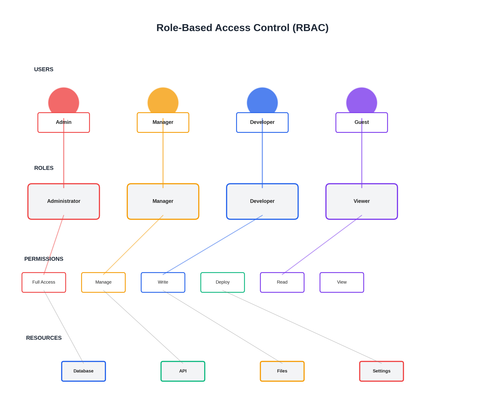
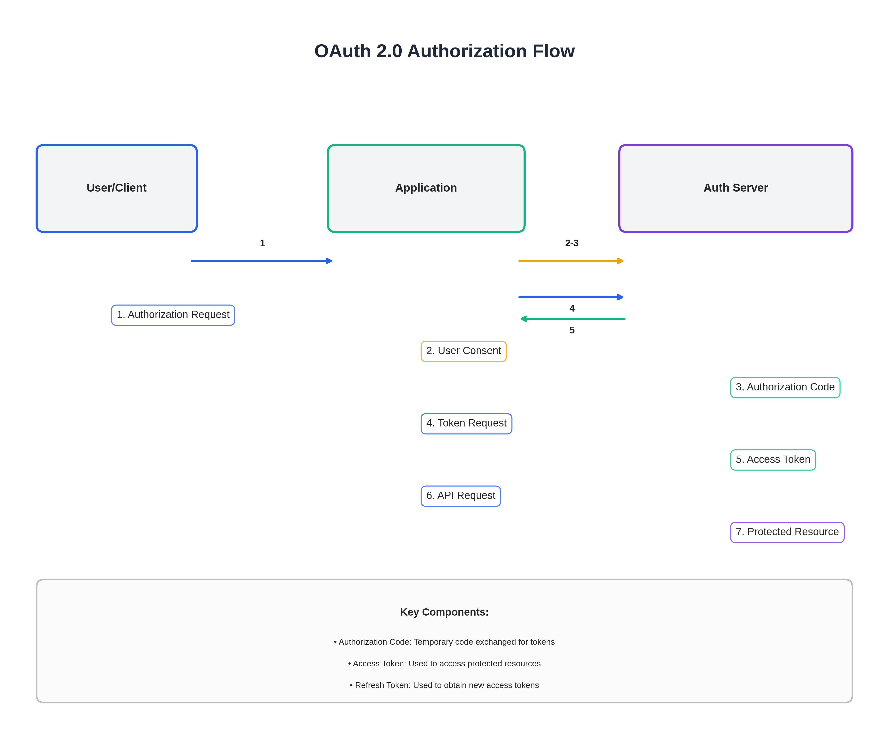
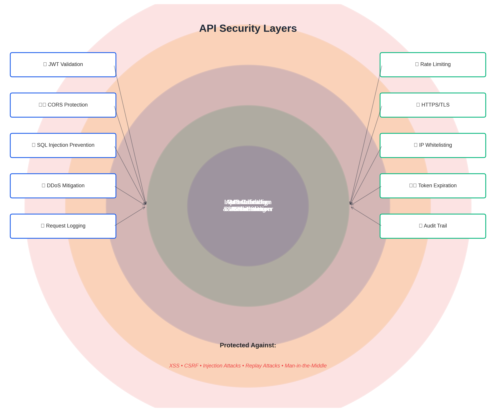
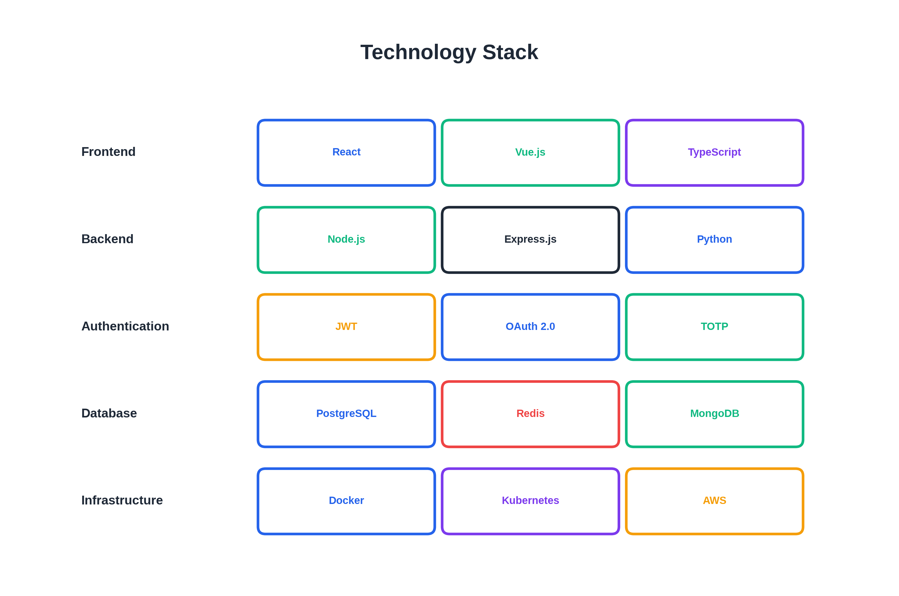
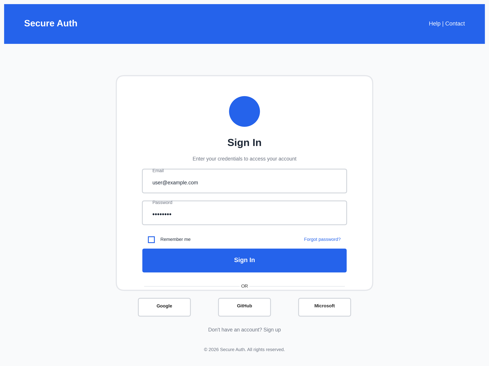
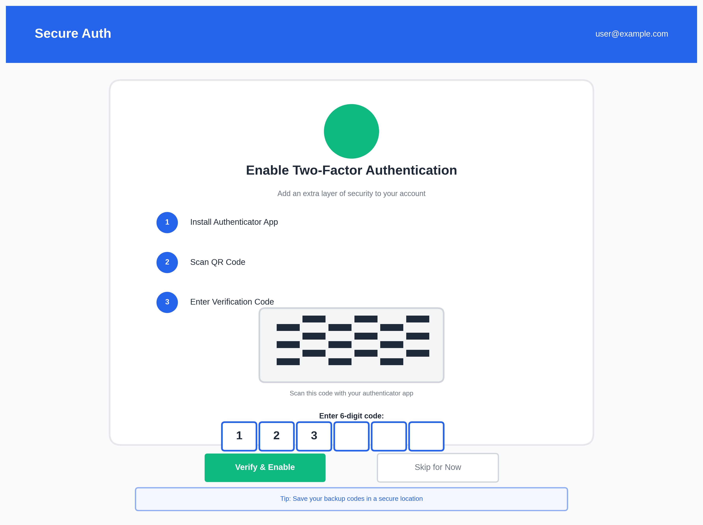
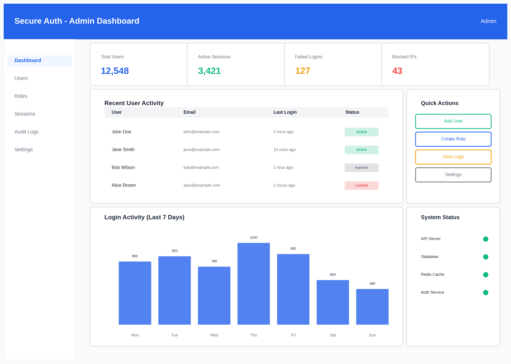

# Secure Auth

<p align="center">
  
</p>

<p align="center">
  <strong>Robust identity and access management system providing secure authentication, fine-grained authorization, and comprehensive protection against unauthorized access.</strong>
</p>


---

## 📊 System Architecture

<p align="center">
  
</p>

## 🚀 Features

### 1. User Authentication
- Secure user registration and login
- Password hashing with strong cryptographic algorithms
- Token-based authentication (JWT / Access Tokens)
- Session and stateless authentication support

### 2. Multi-Factor Authentication (MFA)


- OTP-based verification (Email/SMS/App)
- Time-based One-Time Passwords (TOTP)
- Backup and recovery codes
- MFA enforcement policies

### 3. Authorization & Access Control


- Role-Based Access Control (RBAC)
- Permission-based authorization
- Attribute-Based Access Control (ABAC)
- Route- and resource-level protection

### 4. Token & Session Management
- Access token and refresh token lifecycle
- Token rotation and expiration policies
- Session invalidation and logout handling
- Concurrent session control

### 5. OAuth & External Identity Providers


- OAuth 2.0 login integration
- Social and enterprise identity providers
- Secure token exchange flows
- Identity federation support

### 6. Security Hardening
- Brute-force and rate-limit protection
- CAPTCHA and login attempt throttling
- IP-based access control
- Device and location awareness

### 7. Password & Credential Management
- Password strength enforcement
- Password reset and recovery flows
- Credential rotation policies
- Compromised credential detection

### 8. Audit Logging & Monitoring


- Authentication and authorization logs
- Login success/failure tracking
- Suspicious activity detection
- Compliance-ready audit trails

### 9. Encryption & Data Protection
- Encryption at rest and in transit
- Secure secret and key management
- Token signing and verification
- Secure cookie handling

### 10. API Security Layer


- Secure API authentication middleware
- Token validation and claims inspection
- Scope-based API access
- Protection against replay attacks

### 11. Admin & Security Controls
- User and role management dashboard
- Security policy configuration
- Token revocation controls
- System-wide security settings

### 12. Scalability & Reliability
- Stateless authentication services
- Horizontal scalability support
- High availability token validation
- Cloud-native deployment readiness

---

## 📁 Project Structure

```
secure-auth/
├── README.md
├── .env
├── .gitignore
├── package.json
├── docker-compose.yml
├── docs/
├── config/
├── src/
├── frontend/
├── scripts/
└── images/
    ├── logo.png
    ├── architecture-diagram.png
    ├── mfa-flow.png
    ├── rbac-diagram.png
    ├── oauth-flow.png
    ├── monitoring-dashboard.png
    └── api-security.png
```

## 🛠️ Technology Stack

<p align="center">
  
</p>

- **Backend**: Node.js, Express.js
- **Database**: PostgreSQL
- **Cache**: Redis
- **Authentication**: JWT, OAuth 2.0
- **MFA**: TOTP, OTP
- **Encryption**: bcrypt, crypto
- **Testing**: Jest, Supertest

---

## 🚦 Getting Started

### Prerequisites
- Node.js 18+
- PostgreSQL 14+
- Redis 6+
- Docker (optional)

### Installation

1. Clone the repository
```bash
git clone <repository-url>
cd secure-auth
```

2. Install dependencies
```bash
npm install
```

3. Set up environment variables
```bash
cp .env.example .env
# Edit .env with your configuration
```

4. Set up database
```bash
npm run db:migrate
npm run db:seed
```

5. Start services
```bash
# Using Docker Compose
docker-compose up -d

# Or manually
npm run dev
```

---

## 📸 Screenshots

### Login Interface


### MFA Setup


### Admin Dashboard


---


## 👤 Creator

- 💼 **Created by**: Kshama Mishra

---

<p align="center">
  Created by Kshama Mishra
</p>
