# Service Flow

<p align="center">
  
</p>

<p align="center">
  <strong>Advanced service request management and workflow orchestration platform</strong>
</p>


---

## 📋 Overview

Service Flow is a comprehensive platform for managing service requests with SLA enforcement, approval engines, and powerful analytics. Built for enterprise-scale operations, it provides end-to-end workflow orchestration and real-time tracking.

<p align="center">
  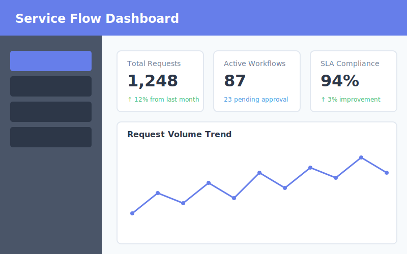
</p>

---

## 🚀 Features

### 1. Service Request Management
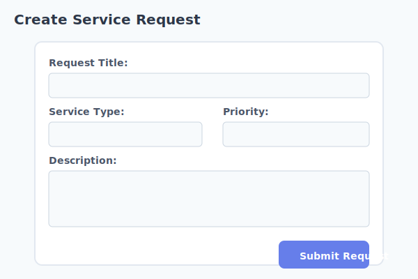

- Create and manage service requests
- Categorization by service type, priority, and SLA
- Request templates for recurring services
- Attachment and metadata support

### 2. Workflow & Process Orchestration
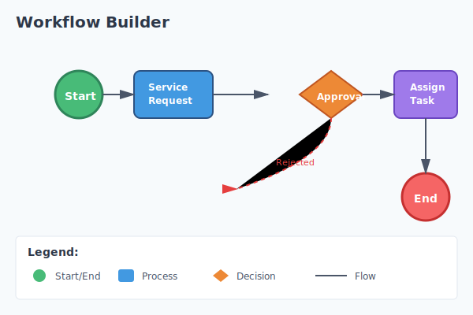

- Visual workflow builder (stages, transitions, approvals)
- Conditional branching and parallel flows
- Auto-routing of service requests
- Workflow versioning and rollback

### 3. Approval & Escalation Engine
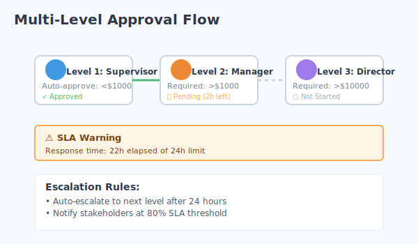

- Multi-level approval flows
- SLA-based escalation rules
- Auto-approval for predefined conditions
- Time-bound decision enforcement

### 4. Task Generation & Assignment
- Automatic task creation per workflow stage
- Dynamic assignment based on workload or role
- Subtasks and checklists
- Dependency handling

### 5. Status Tracking & Lifecycle Control
- End-to-end service lifecycle tracking
- State transitions with validation
- Pause, resume, and cancel flows
- Service closure and archival

### 6. Notifications & Communication
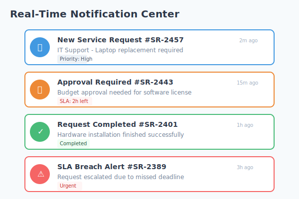

- Real-time notifications on status changes
- Email, SMS, and in-app alerts
- Stakeholder communication logs
- Reminder and escalation alerts

### 7. SLA & Compliance Management
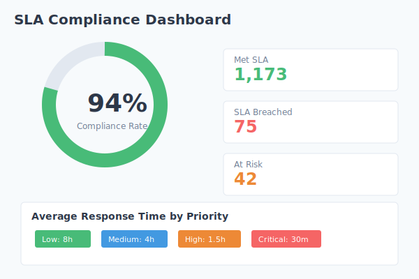

- SLA definition and enforcement
- Breach detection and reporting
- Compliance audit trails
- Policy-driven service governance

### 8. Analytics & Performance Insights
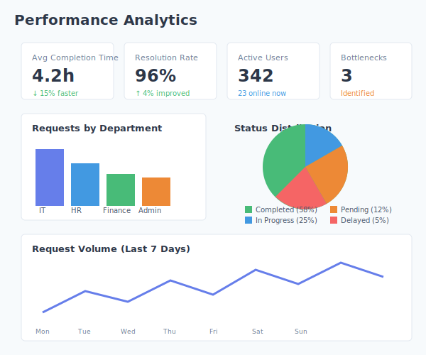

- Service turnaround time analytics
- Bottleneck identification
- SLA compliance reports
- Department-wise performance metrics

### 9. Automation & Rules Engine
- Event-driven automation rules
- Trigger–condition–action model
- Auto-status updates
- Smart service routing logic

### 10. Integration & API Layer
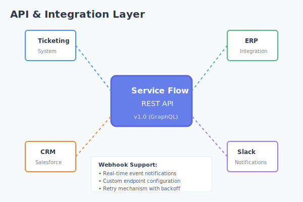

- REST APIs for external systems
- Webhooks for event notifications
- Integration with ticketing, ERP, or CRM systems
- Import/export of service data

### 11. Security & Access Control
- Role-based access management
- Secure authentication and authorization
- Encrypted service data
- Activity and access logs

### 12. Reliability & Scalability
- Asynchronous workflow execution
- Queue-based task processing
- Fault-tolerant execution engine
- Horizontal scalability support

---

## 🏗️ Architecture

<p align="center">
  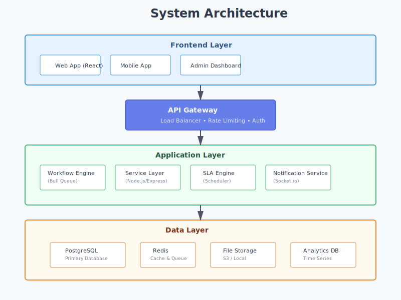
</p>

---

## 📁 Project Structure

```
service-flow/
├── README.md
├── .env
├── .gitignore
├── package.json
├── docker-compose.yml
├── docs/
├── config/
├── src/
├── images/
│   ├── logo.svg
│   ├── dashboard-preview.svg
│   ├── workflow-builder.svg
│   ├── approval-flow.svg
│   ├── analytics-dashboard.svg
│   └── architecture-diagram.svg
└── scripts/
```

---

## 🛠️ Technology Stack

<p align="center">
  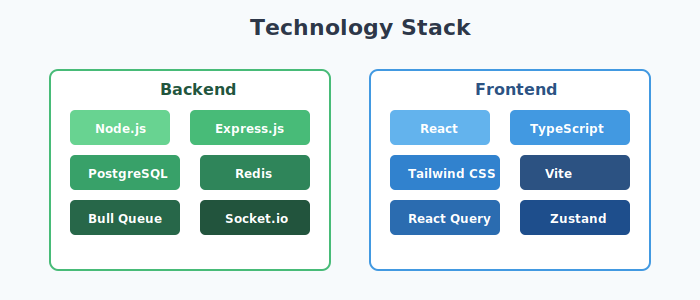
</p>

- **Backend**: Node.js, Express.js
- **Database**: PostgreSQL
- **Cache**: Redis
- **Queue**: Bull Queue
- **Authentication**: JWT, OAuth2
- **Real-time**: WebSocket (Socket.io)
- **Testing**: Jest, Supertest

---

## 🚦 Getting Started

### Prerequisites

- Node.js 18+
- PostgreSQL 14+
- Redis 6+
- Docker (optional)

### Installation

1. **Clone the repository**
```bash
git clone <repository-url>
cd service-flow
```

2. **Install dependencies**
```bash
npm install
```

3. **Set up environment variables**
```bash
cp .env.example .env
# Edit .env with your configuration
```

4. **Set up database**
```bash
npm run db:migrate
npm run db:seed
```

5. **Start services**
```bash
# Using Docker Compose
docker-compose up -d

# Or manually
npm run dev
```

### Quick Start with Docker

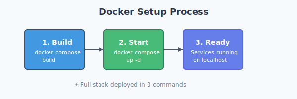

```bash
# Start all services
docker-compose up -d

# View logs
docker-compose logs -f

# Stop services
docker-compose down
```

---

## 📊 Screenshots

### Request Tracking
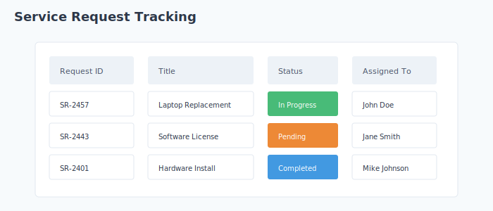

### Performance Metrics
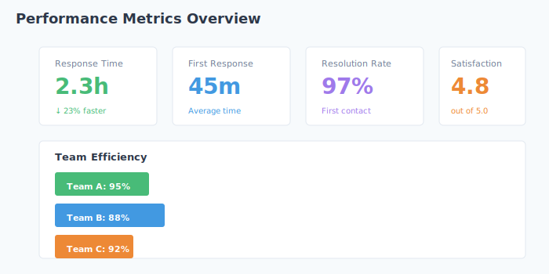

---

## 📝 API Documentation

See [API Documentation](docs/api-documentation.md) for detailed API endpoints.

### Quick API Reference

```bash
# Create a service request
POST /api/v1/requests

# Get workflow status
GET /api/v1/workflows/:id/status

# Approve a task
POST /api/v1/approvals/:id/approve
```

---

## 🔒 Security

See [Security Documentation](docs/security.md) for security best practices.

- 🔐 JWT-based authentication
- 🛡️ Role-based access control (RBAC)
- 🔒 End-to-end encryption
- 📝 Comprehensive audit logging

---

## 🧪 Testing

```bash
# Run all tests
npm test

# Run unit tests
npm run test:unit

# Run integration tests
npm run test:integration

# Generate coverage report
npm run test:coverage
```

---


## 👤 Creator

- 💼 **Created by**: Kshama Mishra

---

<p align="center">
  Created by Kshama Mishra
</p>

<p align="center">
  
</p>
