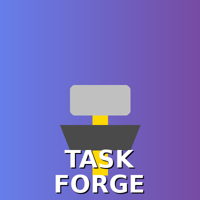
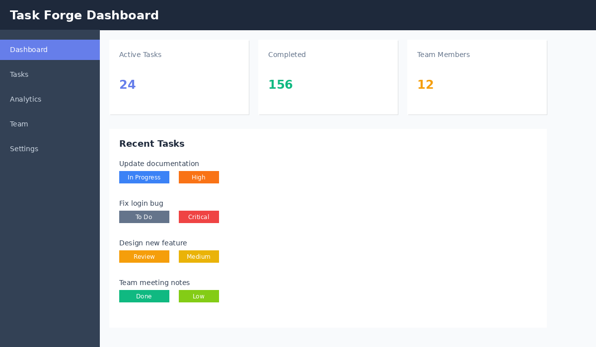
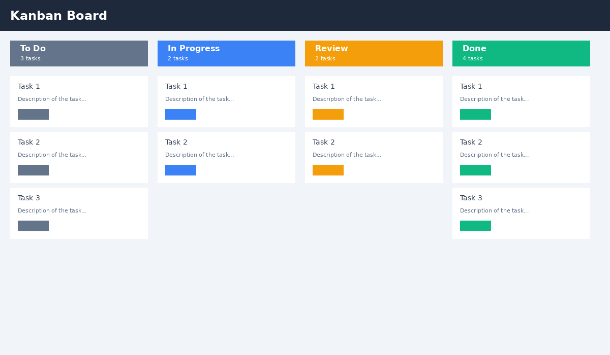
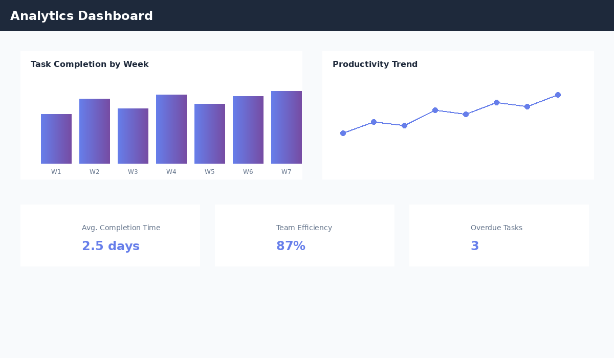
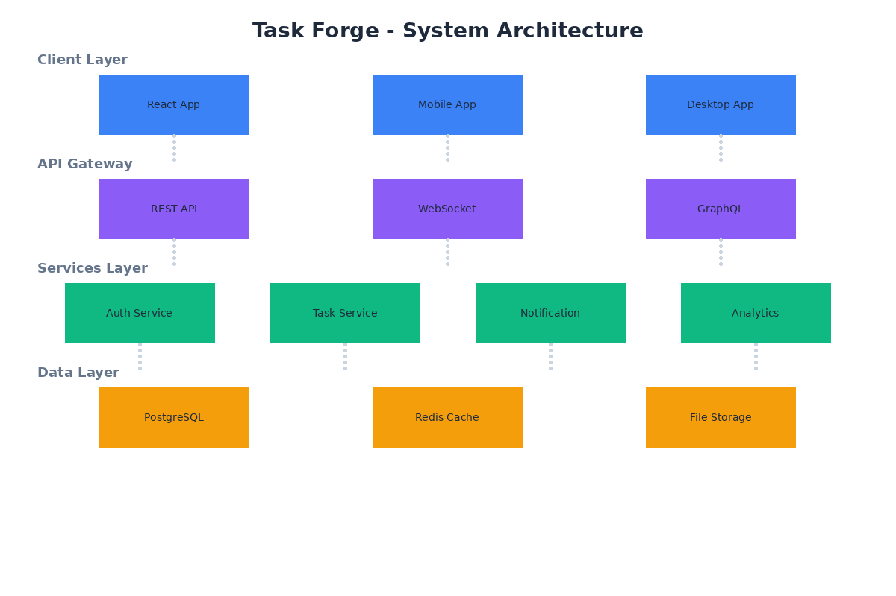
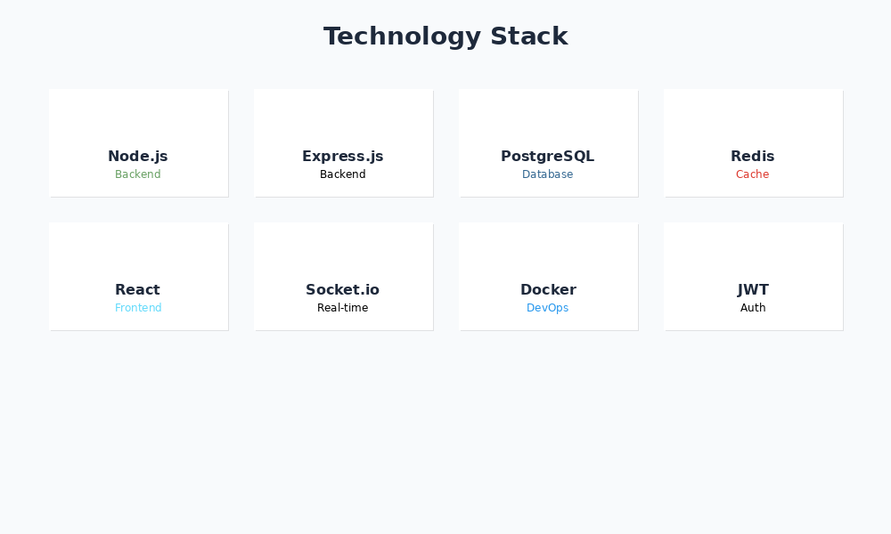

# Task Forge

<p align="center">
  
</p>

<p align="center">
  <strong>Advanced task and workflow management platform with automation, analytics, and collaboration features</strong>
</p>

---


<p align="center">
  
  <br/>
  <em>Main Dashboard - Track all your tasks at a glance</em>
</p>

<p align="center">
  
  <br/>
  <em>Kanban Board - Visualize your workflow</em>
</p>

<p align="center">
  
  <br/>
  <em>Analytics - Gain insights into productivity</em>
</p>

---

## 🚀 Features

### 1. 👥 User & Access Management


- Secure authentication (Email, OAuth, SSO)
- Role-based access control (Admin, Manager, User)
- Team and workspace creation
- Permission-based task visibility

<br/>

### 2. 📋 Task & Workflow Management


- Task creation with priority, deadlines, tags, and dependencies
- Kanban, List, and Timeline views
- Subtasks, checklists, and recurring tasks
- Custom workflow stages

<br/>

### 3. 💬 Collaboration & Communication


- Task-level comments and mentions
- Real-time task updates
- Activity timeline per task and project
- File attachments and inline previews

<br/>

### 4. ⚡ Automation & Rules Engine


- Rule-based task automation
- Auto-status updates and notifications
- SLA and deadline enforcement
- Conditional task triggers

<br/>

### 5. 📊 Progress Tracking & Analytics


- Task completion and productivity dashboards
- Workload distribution insights
- Bottleneck and delay detection
- Exportable analytics reports

<br/>

### 6. ⏱️ Time Tracking & Performance


- Manual and automated time tracking
- Task-level effort reports
- Performance comparison across users and teams
- Productivity trend analysis

<br/>

### 7. 🔔 Notifications & Alerts


- In-app, email, and push notifications
- Smart reminders and escalations
- Custom notification preferences

<br/>

### 8. 📜 Versioning & Audit Trail


- Task change history
- Comment and file version tracking
- Full audit logs for compliance

<br/>

### 9. 🔌 Integrations & API Layer


- REST API for third-party integration
- Calendar and communication tool integration
- Webhooks and automation triggers

<br/>

### 10. 🔒 Security & Reliability


- Encrypted data storage and communication
- Session management and token security
- Backup, recovery, and failover mechanisms

<br/>

---

## 🏗️ Architecture

<p align="center">
  
  <br/>
  <em>High-level system architecture</em>
</p>

---

## 📁 Project Structure

```
task-forge/
├── README.md
├── .env
├── .gitignore
├── package.json
├── docker-compose.yml
├── assets/                    # Images and icons for README
│   ├── logo.png
│   ├── dashboard.png
│   ├── kanban-board.png
│   ├── analytics.png
│   ├── architecture.png
│   ├── tech-stack.png
│   └── icons/
│       ├── user-management.png
│       ├── task-management.png
│       ├── collaboration.png
│       ├── automation.png
│       ├── analytics.png
│       ├── time-tracking.png
│       ├── notifications.png
│       ├── audit.png
│       ├── integrations.png
│       └── security.png
├── docs/
├── config/
├── src/
├── frontend/
└── scripts/
```

---

## 🛠️ Technology Stack

<p align="center">
  
</p>

- **Backend**: Node.js, Express.js
- **Database**: PostgreSQL
- **Cache**: Redis
- **Queue**: Bull Queue
- **Authentication**: JWT, OAuth2
- **Real-time**: WebSocket (Socket.io)
- **Testing**: Jest, Supertest

---

## 🚦 Getting Started

### Prerequisites

- Node.js 18+
- PostgreSQL 14+
- Redis 6+
- Docker (optional)

### Installation

1. **Clone the repository**
   ```bash
   git clone <repository-url>
   cd task-forge
   ```

2. **Install dependencies**
   ```bash
   npm install
   ```

3. **Set up environment variables**
   ```bash
   cp .env.example .env
   # Edit .env with your configuration
   ```

4. **Set up database**
   ```bash
   npm run db:migrate
   npm run db:seed
   ```

5. **Start services**
   ```bash
   # Using Docker Compose
   docker-compose up -d
   
   # Or manually
   npm run dev
   ```

---


## 👤 Creator

- 💼 **Created by**: Kshama Mishra

---

<p align="center">
  Created by Kshama Mishra
</p>
